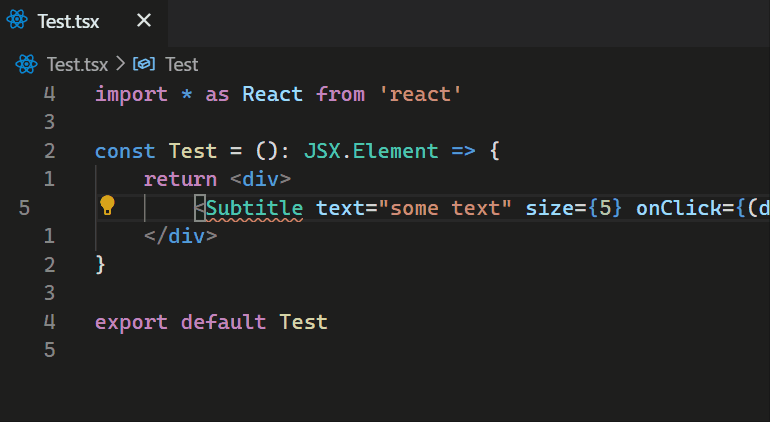

# power-react README

Make your React development easier with PowerReact.

## Features

Create a new component directly through a QuickFix in code, with all the properties set up properly!

## Release Notes

### 0.1.0

Initial release. Features the "Create Component through Quickfix" empty component source code generator.
